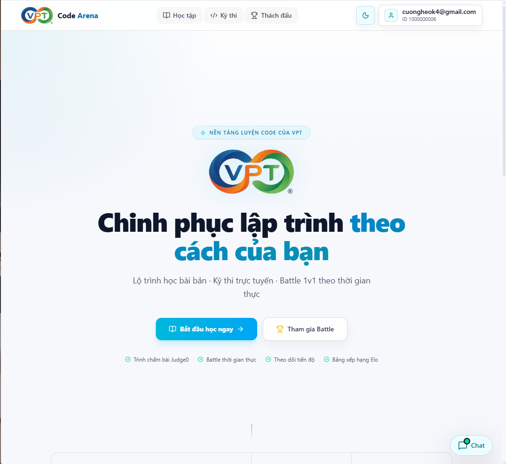
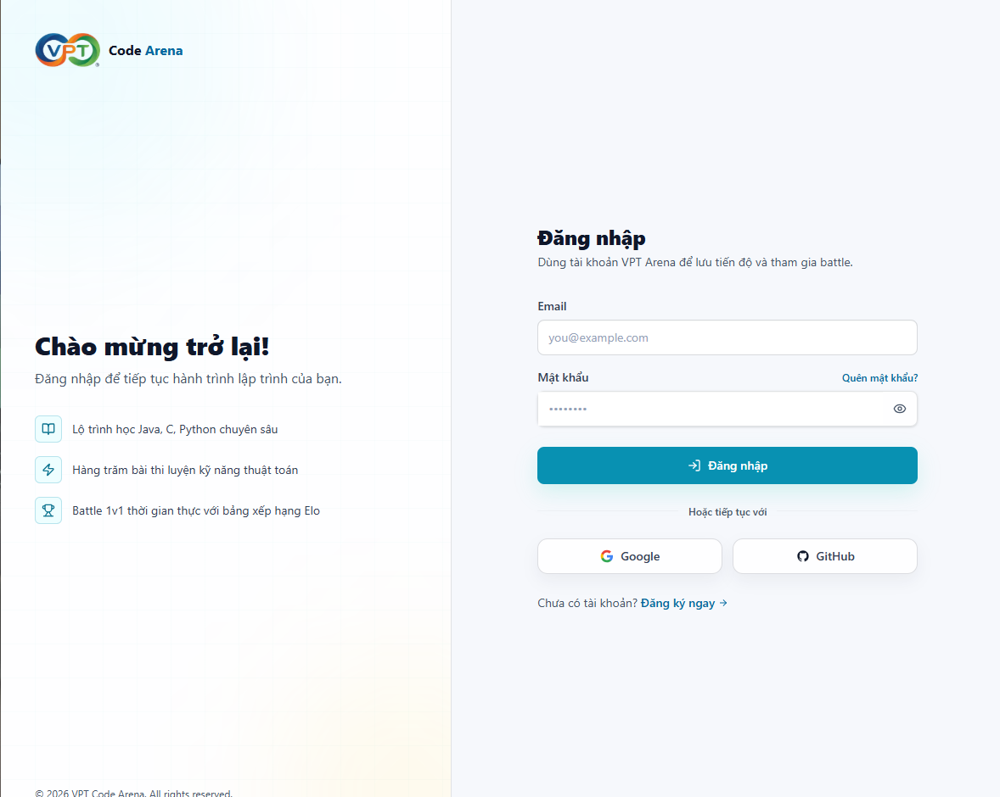
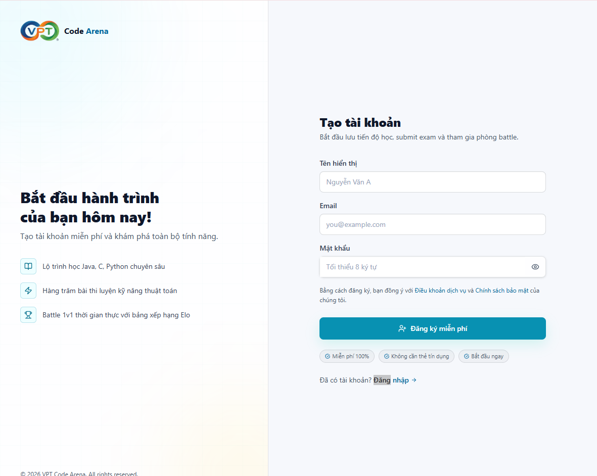
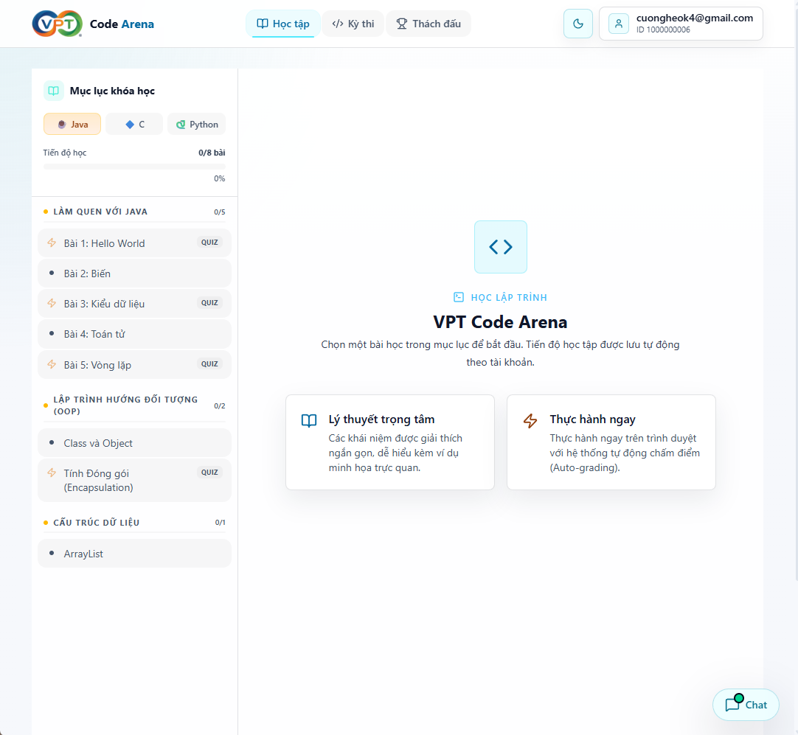
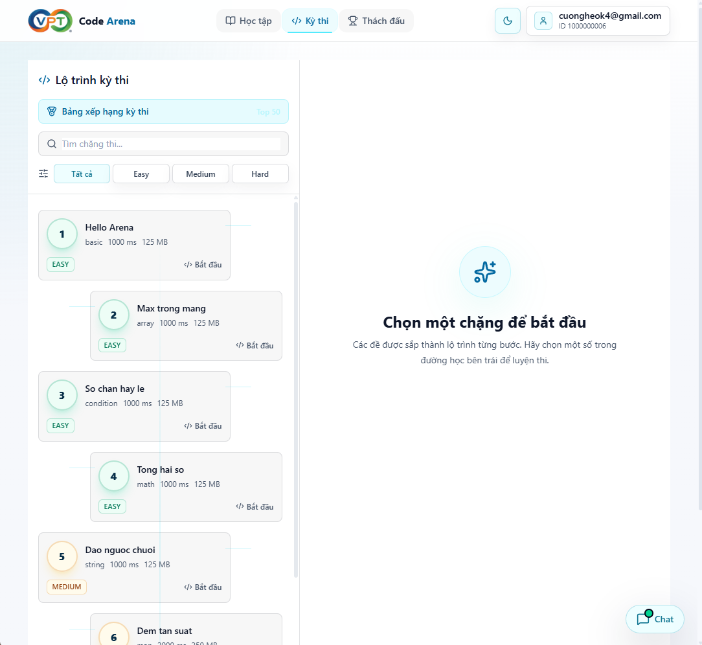
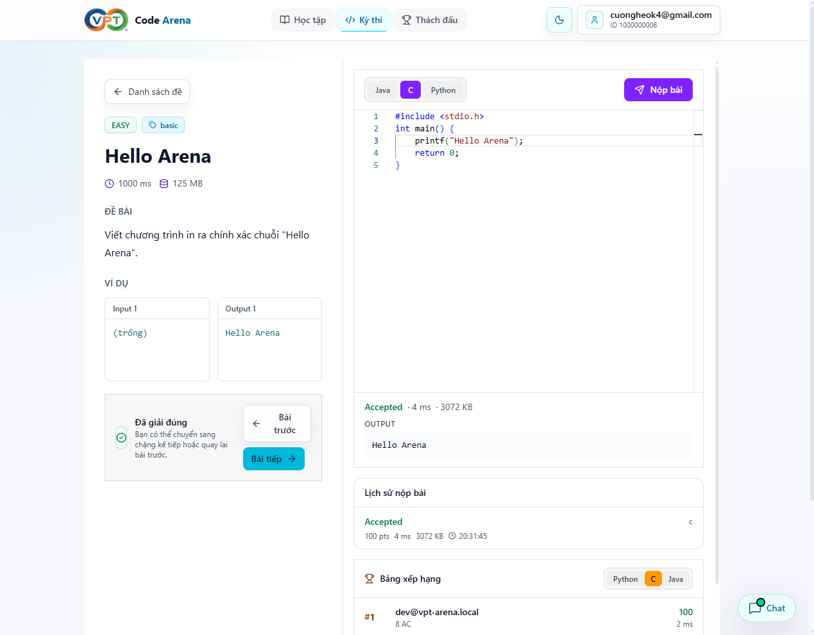
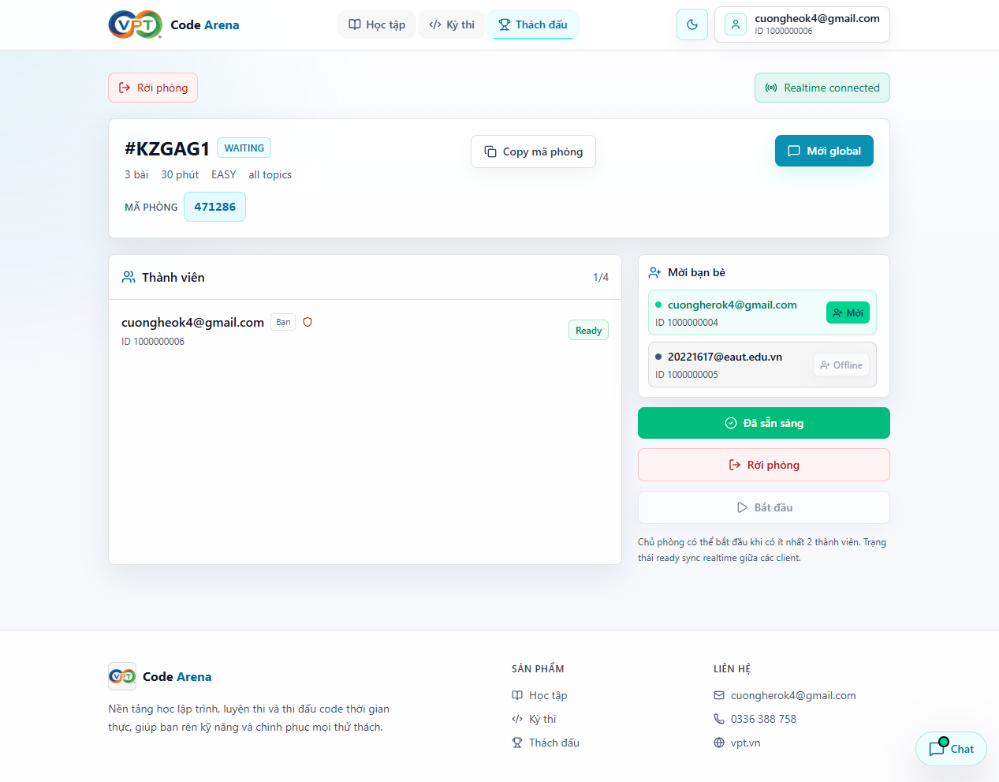
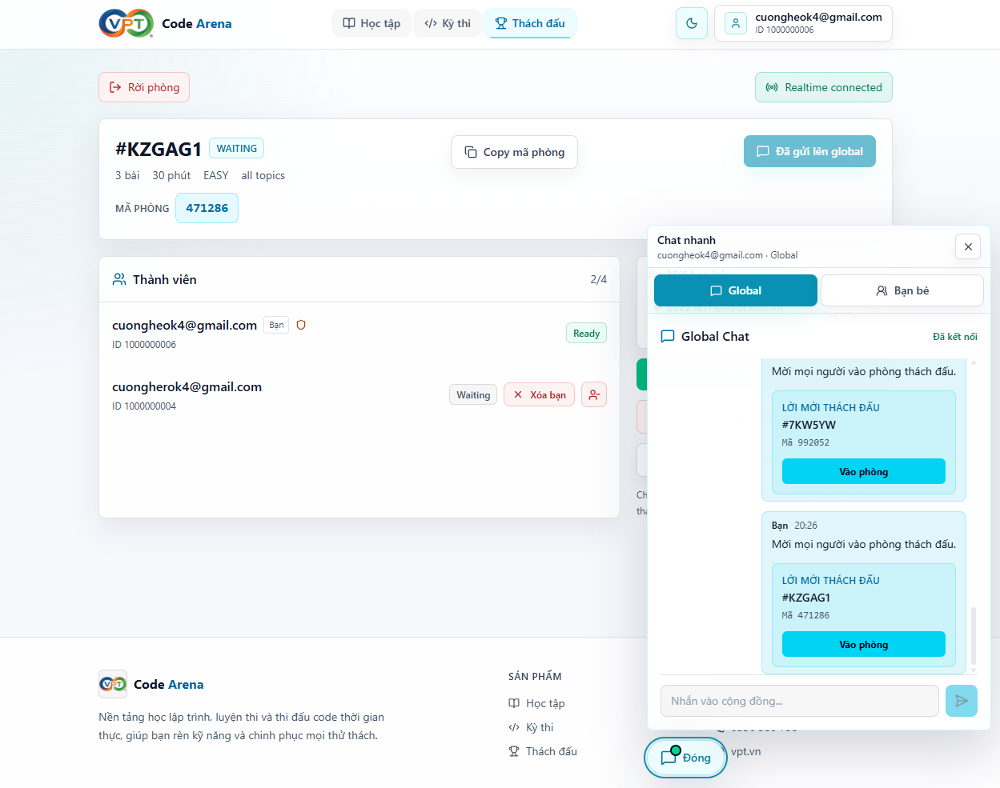
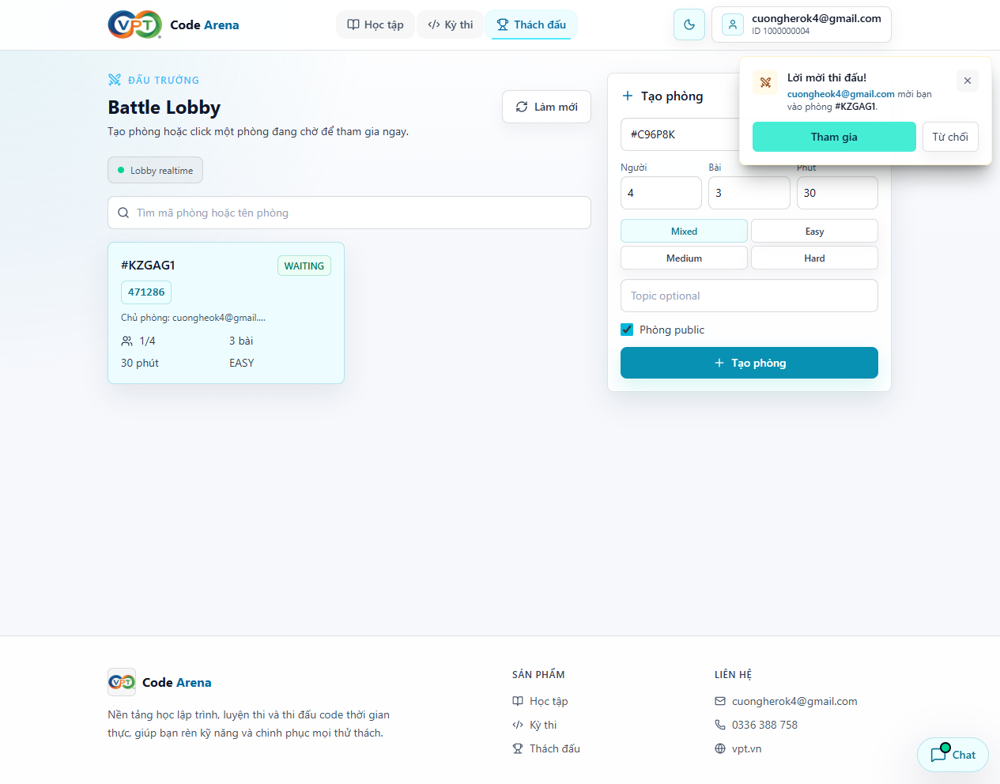
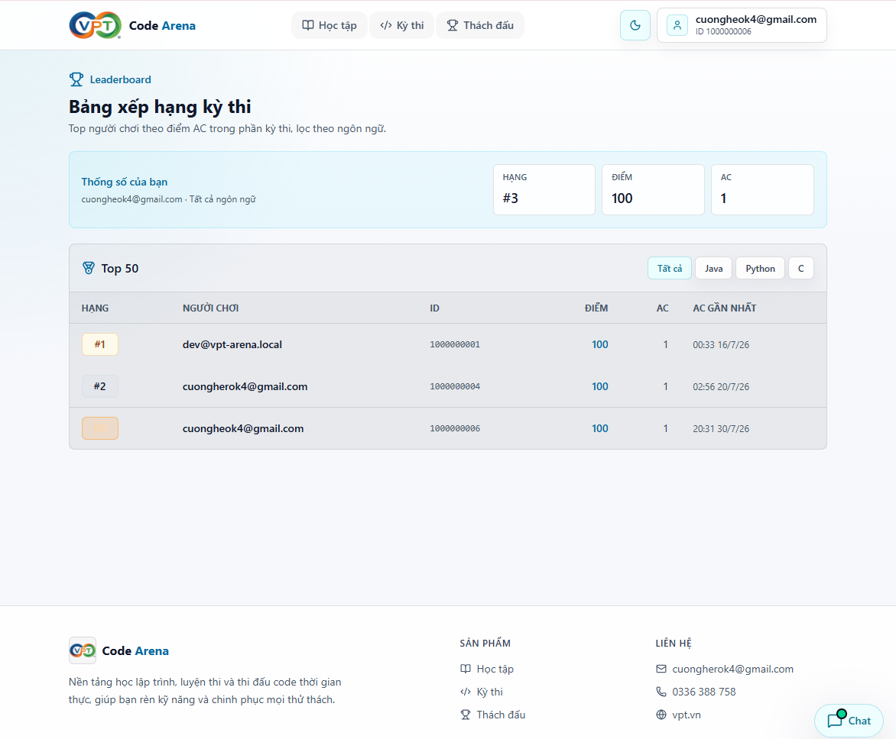

# VPT Code Arena

**VPT Code Arena** là nền tảng học lập trình, luyện đề và thi đấu code trực tuyến. Hệ thống hỗ trợ học theo lộ trình, chạy thử code, submit bài tự động qua Judge0, chat realtime, kết bạn, mời bạn vào phòng đấu và quản trị nội dung qua trang admin.

**Ngày khởi tạo:** 20/05/2026  
**Cập nhật README:** 30/07/2026

---

## Hình Ảnh Giao Diện

### Trang Chủ



### Đăng Nhập Và Đăng Ký





### Học Tập



### Kỳ Thi Và Chấm Code





### Thách Đấu








### Chat Và Bạn Bè


### Bảng Xếp Hạng



---

## Chức Năng Chính

### Xác Thực Người Dùng

- Đăng ký và đăng nhập bằng email/mật khẩu.
- Đăng nhập bằng Google/GitHub OAuth2.
- JWT authentication và refresh token.
- Xác thực email.
- Quên mật khẩu và đặt lại mật khẩu.
- Phân quyền `USER` và `ADMIN`.

### Học Tập

- Học theo chương và bài học.
- Theo dõi tiến độ học tập.
- Chạy thử code trực tiếp trong trình duyệt.
- Submit challenge và nhận kết quả chấm tự động.

### Kỳ Thi / Online Judge

- Danh sách bài lập trình.
- Tìm kiếm, lọc theo độ khó/chủ đề/ngôn ngữ.
- Đọc đề, sample test và giới hạn thời gian/bộ nhớ.
- Submit code và xem lịch sử submit.
- Kết quả chấm gồm `AC`, `WA`, `TLE`, `RE`, `CE`.

### Thách Đấu Realtime

- Tạo phòng đấu công khai hoặc có mật khẩu.
- Mã phòng random để tìm/join nhanh.
- Join/leave phòng realtime.
- Chủ phòng có quyền mời bạn bè và kick người trong hàng chờ.
- Ready/start trận.
- Đồng hồ đếm ngược, submit bài và bảng xếp hạng realtime.
- Gửi lời mời vào chat thế giới để người khác click vào phòng.

### Chat Và Bạn Bè

- Chat global realtime.
- Nhắn tin riêng với bạn bè.
- Hiển thị số tin nhắn mới.
- Danh sách bạn bè, trạng thái online/offline.
- Gửi/chấp nhận/từ chối lời mời kết bạn.
- Kết bạn qua tìm kiếm, chat thế giới hoặc phòng thách đấu.

### Bảng Xếp Hạng Và Thống Kê

- Bảng xếp hạng kỳ thi.
- Thống kê cá nhân.
- Activity calendar.
- Cache Redis để tăng tốc truy vấn leaderboard.

### Admin

- Dashboard thống kê hệ thống.
- Quản lý người dùng.
- Ban/unban tài khoản.
- Quản lý đề bài.
- Tạo/sửa/xóa/publish problem.
- Quản lý test cases, độ khó và chủ đề.

---

## Công Nghệ Sử Dụng

### Frontend

- Node.js 20
- React 19.2.7
- TypeScript 6.0.2
- Vite 8.1.1
- Tailwind CSS 4.3.2
- React Router DOM 7.18.1
- TanStack React Query 5.101.2
- Zustand 5.0.14
- Axios 1.18.1
- Socket.IO Client 4.8.3
- Monaco Editor
- Lucide React

### Backend

- Java 21
- Spring Boot 4.1.0
- Spring Security
- Spring Data JPA / Hibernate
- PostgreSQL 16
- Redis 7
- Flyway
- JWT `jjwt 0.12.5`
- OAuth2 Client
- Bucket4j
- SpringDoc OpenAPI
- JUnit, Mockito, MockMvc

### Realtime Service

- Node.js 20
- TypeScript
- Express 5.2.1
- Socket.IO 4.8.3
- Redis Pub/Sub

### Judge Service

- Node.js 20
- TypeScript
- Bull Queue
- Axios
- Judge0 1.13.1

### DevOps

- Docker
- Docker Compose
- GitHub Actions
- Maven Wrapper

---

## Kiến Trúc Hệ Thống

```text
Frontend React + Vite
        |
        | REST API / WebSocket
        |
Backend Spring Boot  <------ Redis Pub/Sub ------>  WebSocket Service
        |
        | REST / Queue
        |
Judge Service  ------>  Judge0
        |
PostgreSQL + Redis
```

Backend Java Spring Boot xử lý nghiệp vụ chính như auth, học tập, kỳ thi, battle, bạn bè, leaderboard và admin. Node.js được dùng cho realtime service và judge queue để hệ thống nhẹ, dễ tách luồng realtime khỏi nghiệp vụ chính.

---

## Cấu Trúc Dự Án

```text
vpt-code-arena/
├── backend/                # Spring Boot REST API
├── frontend/               # React + Vite
├── websocket-service/      # Socket.IO realtime service
├── judge-service/          # Judge queue worker
├── infrastructure/         # Docker Compose, Judge0 config
├── docs/                   # Tài liệu thiết kế/triển khai
├── img/                    # Ảnh minh họa giao diện README
└── .github/workflows/      # CI
```

---

## Yêu Cầu Cài Đặt

- Java JDK 21
- Node.js 20
- Docker Desktop
- PostgreSQL
- Redis

Khuyến nghị dùng Docker Compose để chạy PostgreSQL, Redis và Judge0.

---

## Chạy Dự Án

### 1. Clone repository

```bash
git clone https://github.com/cuongherok4/vpt-code-arena.git
cd vpt-code-arena
```

### 2. Khởi động hạ tầng

```bash
cd infrastructure
docker compose up -d
```

### 3. Chạy Backend

```bash
cd backend
./mvnw spring-boot:run
```

Trên Windows:

```powershell
cd backend
.\mvnw.cmd spring-boot:run
```

Backend chạy tại:

```text
http://localhost:8080
```

Swagger:

```text
http://localhost:8080/swagger-ui.html
```

### 4. Chạy Frontend

```bash
cd frontend
npm install
npm run dev
```

Frontend chạy tại:

```text
http://localhost:5173
```

### 5. Chạy WebSocket Service

```bash
cd websocket-service
npm install
npm run dev
```

### 6. Chạy Judge Service

```bash
cd judge-service
npm install
npm run dev
```

---

## Kiểm Tra

### Backend

```bash
cd backend
./mvnw test
```

### Frontend

```bash
cd frontend
npm run build
npm run lint
```

### WebSocket Service

```bash
cd websocket-service
npm run build
```

### Judge Service

```bash
cd judge-service
npm run build
```

---

## Lưu Ý

- Không commit file `.env`.
- Không commit JWT secret, OAuth secret hoặc mail password.
- Tài khoản admin cần được cấp role `ADMIN` trong database.
- Sau khi đổi role, người dùng cần đăng nhập lại để JWT chứa role mới.
- Nếu reset volume Judge0, cần áp dụng lại cấu hình Java runtime trong `infrastructure/judge0-java-runtime.sql`.

---

## Trạng Thái Hiện Tại

Hệ thống đã hoàn thiện ở mức MVP/demo với các module chính: auth, học tập, kỳ thi, thách đấu realtime, chat, bạn bè, leaderboard và admin. Các bước còn nên hoàn thiện thêm trước production gồm E2E test, load test, security audit, monitoring và deployment production.

---

## License

MIT License.
